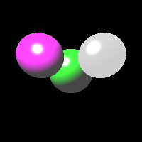

# Ray Tracer
## Description
This project is an implementation of a simple ray tracer using linear algebra to derive the formulas.
The project allows to add speheres to the scene, and choose their position size, colour and material properties.
The implementation also allows to use multiple sources in the scene and choose their colours and positions.
Lastly, it is possible to choose the position of the camera.

## Usage
To change the position of the camera change the following line and choose your own coordinates x, y, z:
```
cam_pos = Point(x, y, z)
```

To add light sources, populate the *lights* array with *Light* objects as follows:
```
lights = [
    Light(Point(x, y, z), Colour(hex="#ffffff").from_hex()),
    Light(Point(0, 0, 0), Colour(hex="#00ff00").from_hex()),
]
```
You need to choose your own coordinates for the positiong of the light source and colour in hex or rgb with each value in the range of 0–1.

To add your own spheres to the scene, change the array *objects* and populate it with *Sphere* objects. You can add a sphere as follows:
```
objects = [
    Sphere(
        pos=Point(0, 0, 0),
        rad=0.3,
        col=Colour(hex="#00ff00").from_hex(),
        ambient=0.07,
        diffuse=0.6,
        specular=0.9,
    )
]
```
Choose the coordinates to put the sphere, its radius, colour in hex or rgb with each value in the range of 0–1.
You also need to choose the values of ambient, diffuse and specular parameters, all of which can be chosen in the range of 0–1.

The resulting image will be saved to the directory where the raytracer.py file is stored as def.ppm.
To change the resolution of the image change the *WIDTH* and *HEIGHT* parameters in the code.

Below follows an example of the resulting image!

